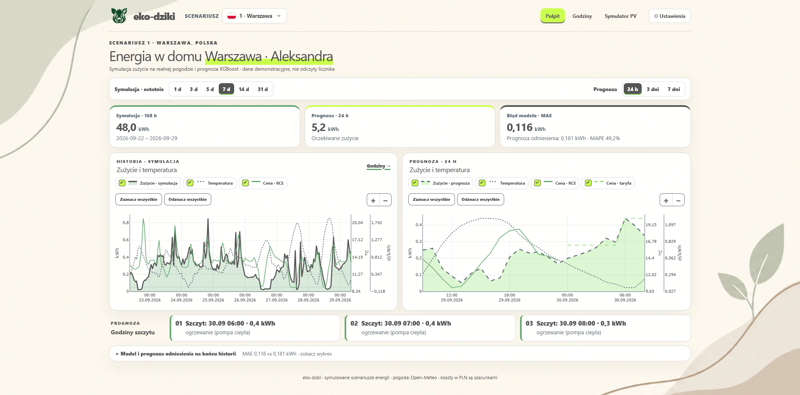
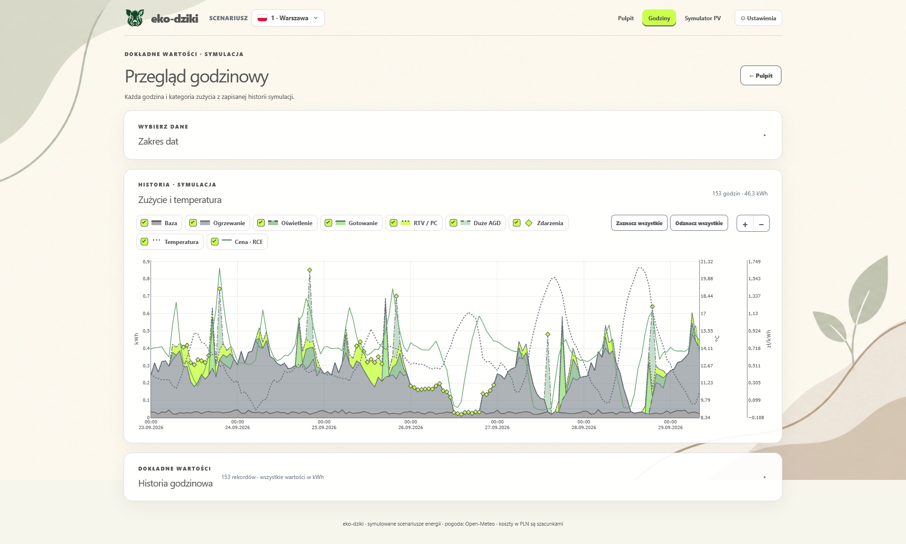
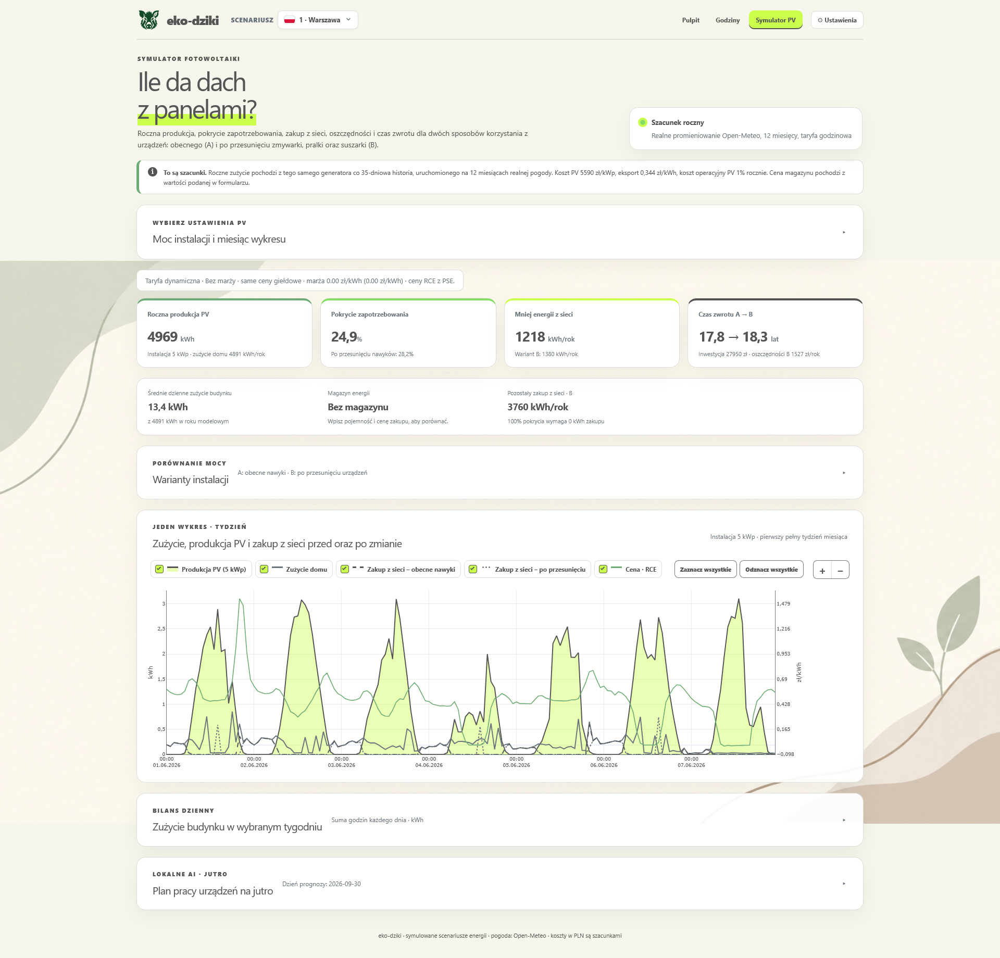

# Eko-dziki

**Eko-dziki** to lokalna aplikacja do analizy i optymalizacji zużycia energii w domu. Łączy symulację zużycia energii, dane pogodowe, prognozowanie zapotrzebowania, analizę taryf oraz symulator instalacji fotowoltaicznej i magazynu energii.

Aplikacja działa lokalnie jako projekt **Django** i udostępnia również REST API przeznaczone do komunikacji z aplikacją mobilną.

**! dane dotyczące zużycia energii są danymi symulowanymi. Nie są to bezpośrednie odczyty z rzeczywistego licznika energii.**

---

## Najważniejsze funkcje

### Dashboard



Główny pulpit to serce naszego systemu zarządzania energią. Został zaprojektowany tak, aby łączyć zaawansowaną analitykę danych z przystępnym interfejsem użytkownika (UI/UX). Pulpit dynamicznie reaguje na wybór 1 z 5 oficjalnych scenariuszy domostw.

**Kluczowe funkcjonalności techniczne:**
* **Interaktywna analityka wizualna:** Wykorzystanie biblioteki `Plotly.js` do renderowania wykresów w przeglądarce.
* **Predykcja AI (XGBoost):** Prezentacja wyników zaimplementowanego modelu Extreme Gradient Boosting, który prognozuje zapotrzebowanie na **24 h, 3 dni i 7 dni** do przodu, uwzględniając takie zmienne jak temperaturę czy nasłonecznienie, pory dnia. Na podstawie predykcji są wyświetlane godziny szczytu.
* **Ewaluacja modelu na żywo (Backtesting):** System w czasie rzeczywistym porównuje skuteczność modelu AI względem prymitywnego baseline'u ("to samo co tydzień temu"), prezentując twarde metryki błędu: **MAE** (Mean Absolute Error) oraz **MAPE**.
* **Elastyczny zakres czasowy:** Szybkie filtrowanie historii agregatów za `1 / 3 / 5 / 7 / 14 / 31 dni`.
---

### Analiza godzinowa



Widok `/godziny/` to moduł analityczny dla osób chcących dokładniej przejrzeć swoją historię energetyczną. 

**Aspekty techniczne i funkcjonalności:**
* **Mechanika Bottom-Up:** Wykresy warstwowe ukazują 6 symulowanych kategorii (m.in. Ogrzewanie z uwzględnieniem COP pompy ciepła, Baza, Duże AGD) bazowanych na faktycznych historycznych danych pogodowych.
* **Rozszerzona Paginacja (Django ORM):** Wykorzystanie natywnego `Paginatora` Django do sprawnego serwowania ogromnych zbiorów danych (tysiące rekordów godzinowych) na front-end bez obciążania pamięci RAM serwera.
* **Data Export:** Funkcjonalność zrzutu surowych, połączonych danych historycznych oraz predykcyjnych bezpośrednio do pliku **CSV**, co umożliwia weryfikację modelu i dalszą obróbkę danych w narzędziach zewnętrznych.

---

### Symulator OZE i Zarządzania Energią



Ten moduł bada opłacalność inwestycji w odnawialne źródła energii (OZE) na podstawie historycznego profilu użytkownika.

**Kluczowe wskaźniki (KPI) przeliczane w czasie rzeczywistym:**
* Optymalna moc instalacji w kWp,
* Szacunkowa roczna produkcja energii z uwzględnieniem czynnika,
* Procentowe pokrycie zapotrzebowania domu,
* Skrócenie czasu zwrotu inwestycji,
* Estymacja oszczędności wyliczana na bazie wielostrefowych taryf czasowych.

Symulator wykonuje pełny **bilans 8760 godzin** (rok modelowy), zderzając produkcję ze zużyciem w dwóch wariantach, aby udowodnić wartość elastyczności popytu:

| Wariant                      | Opis Mechaniki                                                               |
| ---------------------------- | ---------------------------------------------------------------------------- |
| **A — Baseline (Nawyki)**    | Utrzymanie statusu quo; urządzenia działają wg wygenerowanej historii.       |
| **B — Optymalizacja DSR**    | Dynamiczne przesunięcie elastycznych obciążeń (zmywarka, pralka, suszarka) na tzw. okno słoneczne (**9:00–15:00**). |

**Wsparcie dla Magazynów Energii (BESS):**
System integruje wirtualny magazyn energii, pozwalając na wpisanie *Pojemności [kWh]*, *Mocy [kW]* oraz *Kosztu CAPEX [EUR]*. Bilans ładowania z nadwyżek PV uwzględnia realistyczną **sprawność cyklu na poziomie 90%**.

---

### Inteligencja Behawioralna: "Plan Pracy na Jutro" (AI)

Największą innowacją systemu jest sekcja **Planu Pracy Urządzeń**, która wykorzystuje hybrydowe podejście inżynieryjne (Fizyka + LLM):

1. **Silnik Decyzyjny (Python Backend):** Agreguje 35 dni historii cykli, taryfy prądowe, model PV i stan magazynu, a następnie wylicza macierz kosztów dla jutrzejszej prognozy (24h). Odrzuca warianty nieopłacalne, pozostawiając tylko godziny gwarantujące widoczną oszczędność.
2. **Generatywna Sztuczna Inteligencja (Lokalny model Qwen3):** Otrzymuje czyste dane liczbowe i generuje spersonalizowane uzasadnienie dla użytkownika.
3. **Ekstrapolacja Roczna:** Obliczone oszczędności dzienne są skalowane rocznie na podstawie historycznej częstotliwości uruchamiania cykli, dając użytkownikowi realny obraz korzyści finansowych.
4. **Złożona logika zdarzeń:** Silnik wykrywa unikalne zdarzenia z wybranych scenariuszy (np. praca zdalna, opieka nad psem). W przypadku **pompy basenowej** optymalizator proponuje przesunięcie cyklu *tylko wtedy*, gdy globalnie obniża to koszt funkcjonowania całego domu.

---

## Dane pogodowe

Do generowania scenariusza wykorzystywane są rzeczywiste dane pogodowe z **Open-Meteo**.

Pogoda wpływa m.in. na:

* symulowane zużycie energii,
* sezonowość zapotrzebowania,
* produkcję energii z PV.

Dane obejmują historię, prognozę oraz pełny rok modelowy.

Jeżeli pobranie danych z Open-Meteo nie powiedzie się, aplikacja może wykorzystać wcześniej zapisane dane pogodowe.

---

## Prognozowanie zużycia

Projekt wykorzystuje modele uczenia maszynowego do prognozowania zapotrzebowania energetycznego.

W repozytorium znajdują się m.in. biblioteki:

* `scikit-learn`
* `xgboost`
* `numpy`
* `pandas`

Model może generować prognozy dla:

* **24 godzin**,
* **72 godzin**,
* **168 godzin**.

Dostępne są również metryki oceny modelu, m.in. **MAE** i **MAPE**.

---

## Aplikacja mobilna

Repozytorium zawiera aplikację mobilną jako **Git submodule**:

```text
mobile_app
```

Submodule wskazuje na:

`https://github.com/allt3rr/HackoWattMobileApp`

Po sklonowaniu repozytorium razem z submodułami:

```bash
git clone --recurse-submodules https://github.com/kleszczuch/HackoWatt.git
```

Jeżeli repozytorium zostało już sklonowane bez submodułów:

```bash
git submodule update --init --recursive
```

### Kluczowe funkcjonalności aplikacji mobilnej

1. **Szybki podgląd sytuacji w bieżącej godzinie:**
   * **Bieżąca stawka energii:** Wyświetlanie aktualnej ceny prądu za kWh z dynamicznym oznaczeniem strefy cenowej (zielona – tani prąd / okno PV, żółta – stawka średnia, czerwona – drogi szczyt) oraz rekomendacją natychmiastową.
   * **Chwilowy pobór prądu:** Podgląd bieżącego obciążenia domu w czasie rzeczywistym w kWh wraz z informacją o dominującej kategorii urządzeń.
   * **Temperatura zewnętrzna:** Odczyt temperatury (°C) z Open-Meteo, która bezpośrednio warunkuje zapotrzebowanie na ogrzewanie i chłodzenie.
   * **Alert najbliższego szczytu:** Dynamiczne powiadomienie o zbliżającym się szczytowym zapotrzebowaniu z podaniem godziny i prognozowanego poboru.

2. **Harmonogram 24h z podziałem na konkretne godziny i zalecenia (`/schedule`):**
   * **Interaktywna oś 24 godzin:** Wizualna siatka kafelków dla każdej godziny doby z kodowaniem kolorystycznym (zielony / żółty / czerwony) oraz znacznikiem aktualnej godziny („TERAZ”).
   * **Szczegóły wybranej godziny:** Dotknięcie dowolnej godziny rozwija panel z dokładną stawką za kWh oraz konkretną wskazówką działania (np. kiedy włączać pralkę/zmywarkę, a kiedy ograniczyć urządzenia grzewcze).
   * **Rekomendowane okna czasowe:**
     * **Okno słoneczne i dzienne (09:00 – 15:00):** Najtańszy prąd i autokonsumpcja z fotowoltaiki – idealny czas na duże AGD.
     * **Nocna dolina taryfowa (00:00 – 06:00):** Niski koszt energii – rekomendowane dla timerów w zmywarkach/pralkach oraz ładowania aut elektrycznych.
     * **Szczyt popołudniowy (17:00 – 21:00):** Najwyższe ceny – zalecenie unikania jednoczesnego korzystania z płyty indukcyjnej, piekarnika i pralki.
   * **Porady pokoleniowe:** Podpowiedzi dopasowane do domowników (dziadkowie w domu w dzień, młodzież po szkole, pracujący rodzice).

3. **Kalkulator przesunięcia pracy urządzeń AGD (`/devices`):**
   * **Symulacja zysku finansowego w locie:** Narzędzie pozwalające sprawdzić, ile dokładnie użytkownik zaoszczędzi, przesuwając cykl pracy urządzenia.
   * **Wybór sprzętu:** Pralka, zmywarka, suszarka bębnowa, piekarnik/płyta indukcyjna, sprzęt RTV/komputery.
   * **Porównanie godzin:** Możliwość zestawienia dowolnych godzin – np. sprawdzenie, jaki zysk przyniesie uruchomienie pralki jutro o **12:00** (w oknie taniej energii / słońca) zamiast dzisiaj o **19:00** (w drogim szczycie popołudniowym).
   * **Wyliczenie korzyści:** Prezentacja oszczędności w walucie per pojedynczy cykl oraz ekstrapolacja zysku w skali całego roku.

4. **Tryb seniora i personalizacja motywu (`AccessibilityBar`):**
   * **Powiększone litery (skalowanie czcionki):**
     * Szybki wybór presetu: **Młodzież (100%)** vs 👓 **Senior (powiększenie do 118%)**.
     * Precyzyjne stopniowanie przyciskami **A- / A+** (zakres od 90% do 136%) z wskaźnikiem procentowym.
     * Duże, wygodne elementy dotykowe (min. 44×44 px) zaprojektowane z myślą o osobach starszych i słabowidzących.
     * Dynamiczne przeskalowanie wszystkich tekstów w aplikacji (`TextScaleContext`).
   * **Przełącznik motywu (Dzienny / Nocny):**
     * Ergonomiczny, animowany suwak `ThemeSwitch` oparty o NativeWind.
     * **Tryb dzienny (jasny):** Przejrzyste, pastelowe tło (`#F7F6ED`), wysoki kontrast i czytelne ciemne fonty.
     * **Tryb nocny (ciemny):** Głębokie, ciemne tło (`#1A1C1E`), zredukowana emisja światła niebieskiego i kontrastowe akcenty w kolorze chartreuse (`#CBFF4D`).

---

# Uruchomienie na Windows (PowerShell)

Wykonuj poniższe kroki w PowerShellu. Potrzebne są Git, połączenie z internetem
przy pierwszej instalacji i pobieraniu danych oraz miejsce na model Qwen3 1.7B
(około 1,4 GB). Projekt wymaga Pythona `>=3.14,<3.15`; `uv` może go zainstalować.

### Całość w jednej linii

W katalogu sklonowanego projektu uruchom poniższą linię w PowerShellu. Instaluje
uv i Ollamę, odświeża `PATH`, pobiera Pythona i model, przygotowuje dane oraz
uruchamia stronę. Pierwsze wykonanie wymaga internetu; jeśli instalator Ollamy
poprosi o dokończenie instalacji, wykonaj to przed ponownym uruchomieniem linii.

```powershell
$ErrorActionPreference='Stop'; irm https://astral.sh/uv/install.ps1 | iex; irm https://ollama.com/install.ps1 | iex; $env:Path=[Environment]::GetEnvironmentVariable('Path','Machine')+';'+[Environment]::GetEnvironmentVariable('Path','User')+";$HOME\.local\bin"; uv python install 3.14; if($LASTEXITCODE){throw 'Instalacja Pythona nie powiodła się'}; ollama pull qwen3:1.7b; if($LASTEXITCODE){throw 'Pobranie modelu nie powiodło się'}; if(!(Test-Path .env)){ @("API_KEY=$([guid]::NewGuid().ToString('N'))",'OLLAMA_MODEL=qwen3:1.7b','OLLAMA_HOST=http://localhost:11434') | Set-Content -Encoding ascii .env }; uv sync; if($LASTEXITCODE){throw 'Instalacja zależności nie powiodła się'}; uv run python manage.py migrate; if($LASTEXITCODE){throw 'Migracje nie powiodły się'}; uv run python manage.py fetch_tariff_prices; if($LASTEXITCODE){throw 'Pobranie cen nie powiodło się'}; uv run python manage.py prepare_data; if($LASTEXITCODE){throw 'Przygotowanie danych nie powiodło się'}; uv run python manage.py prepare_recommendations; if($LASTEXITCODE){throw 'Przygotowanie rekomendacji nie powiodło się'}; uv run python manage.py runserver 127.0.0.1:8000
```

Adres strony: `http://127.0.0.1:8000/symulator-pv/`. Jeśli ceny PSE są
niedostępne, uruchom rozruch krok po kroku i pomiń samo
`fetch_tariff_prices`; plan użyje wtedy stawki taryfy stałej.

## 1. Zainstaluj uv i Python 3.14

Zainstaluj [uv](https://docs.astral.sh/uv/getting-started/installation/) oficjalnym
instalatorem i otwórz nowy PowerShell, aby odświeżyć `PATH`:

```powershell
powershell -ExecutionPolicy ByPass -c "irm https://astral.sh/uv/install.ps1 | iex"
uv --version
uv python install 3.14
```

Jeśli masz już `uv` i Python 3.14, wystarczy sprawdzić `uv --version`.

## 2. Zainstaluj Ollamę i pobierz model

Zainstaluj [Ollamę dla Windows](https://ollama.com/download/windows), a następnie
otwórz nowy PowerShell:

```powershell
irm https://ollama.com/install.ps1 | iex
ollama --version
ollama pull qwen3:1.7b
ollama list
```

Instalator Windows uruchamia serwer Ollamy w tle pod `http://localhost:11434`.
Sprawdź połączenie i uruchom model próbnie:

```powershell
Invoke-RestMethod http://localhost:11434/api/tags
ollama run qwen3:1.7b
```

Wpisz przykładowe pytanie; zakończ rozmowę poleceniem `/bye`. Po wyjściu
Ollama nadal obsługuje żądania aplikacji w tle. Jeśli `Invoke-RestMethod` nie
może się połączyć, uruchom `ollama serve` w osobnym oknie PowerShell i zostaw
je otwarte. Nie uruchamiaj drugiego serwera, jeśli port `11434` już działa.

## 3. Sklonuj repozytorium i ustaw środowisko

```powershell
git clone --recurse-submodules https://github.com/kleszczuch/HackoWatt.git
cd HackoWatt
uv sync
uv run python --version
```

Jeśli repozytorium zostało wcześniej sklonowane bez submodułu, wykonaj
`git submodule update --init --recursive`.

Utwórz lokalny plik `.env`. Klucz jest potrzebny do mobilnego API; strona
internetowa korzysta z sesji. Domyślny model to `qwen3:1.7b`, ale zapisanie
go w `.env` ułatwia zmianę konfiguracji:

```powershell
$apiKey = [guid]::NewGuid().ToString("N")
@("API_KEY=$apiKey", "OLLAMA_MODEL=qwen3:1.7b", "OLLAMA_HOST=http://localhost:11434") | Set-Content -Encoding ascii .env
```

`.env` jest ignorowany przez Git. Po zmianie `OLLAMA_MODEL` pobierz wskazany
model przez `ollama pull NAZWA_MODELU` i ponownie uruchom serwer Django.

## 4. Przygotuj bazę, ceny i dane

W katalogu projektu wykonaj komendy w tej kolejności:

```powershell
uv run python manage.py migrate
uv run python manage.py fetch_tariff_prices
uv run python manage.py prepare_data
uv run python manage.py prepare_recommendations
```

`fetch_tariff_prices` zapisuje dostępne ceny RCE w `data/tariff_prices.json`.
`prepare_data` pobiera pogodę z Open-Meteo i przygotowuje pięć scenariuszy.
`prepare_recommendations` tworzy plany na jutro dla tych scenariuszy przy
domyślnych ustawieniach i zapisuje je w ignorowanym przez Git
`data/recommendations/`. Pierwsze przeliczenie może potrwać, gdy model ładuje
się do pamięci. Jeśli Ollama nie działa, plan otrzyma źródło
`calculated_fallback` i godziny nadal zostaną wyliczone przez Python.

## 5. Uruchom stronę

```powershell
uv run python manage.py runserver 127.0.0.1:8000
```

Otwórz `http://127.0.0.1:8000/symulator-pv/` i rozwiń sekcję **Plan pracy
urządzeń na jutro**. Po zmianie taryfy w Ustawieniach wróć do symulatora;
po zmianie mocy PV lub magazynu karty pobiorą nowy plan automatycznie.

Gdy chcesz otworzyć lokalny serwer z telefonu w tej samej sieci, możesz użyć
`uv run python manage.py runserver 0.0.0.0:8000` i adresu komputera w sieci.

### Krótszy rozruch po instalacji

Po zainstalowaniu Ollamy, pobraniu modelu i wykonaniu migracji komenda
`all` uruchamia kolejno synchronizację zależności, pobranie cen,
`prepare_data`, `prepare_recommendations` oraz serwer:

```powershell
uv run python manage.py all --addrport 127.0.0.1:8000
```

Komenda `all` nie wykonuje migracji Django ani nie instaluje Ollamy.
Przydatne opcje: `--no-server` przygotowuje dane bez startu serwera,
`--no-sync`, `--no-tariffs`, `--no-data` i `--no-recommendations` pomijają
odpowiednie kroki, a `--noreload` wyłącza automatyczny restart serwera.

### Gdy brakuje cen taryfy dynamicznej

Plan wymaga pełnej prognozy zużycia i pogody na jutro. Jeśli plik RCE nie
zawiera ceny dla części lub wszystkich 24 godzin, aplikacja używa w tych
godzinach **stawek taryfy stałej** i pokazuje, ile godzin miało stawkę
zastępczą. Wykres taryfy oznacza brakujące ceny. Aby pobrać nowe ceny:

```powershell
uv run python manage.py fetch_tariff_prices
uv run python manage.py prepare_recommendations
```

Sprawdź zakres dat wypisany przez `fetch_tariff_prices`. Komunikat „Brak
pobierania” oznacza, że plik nie został zaktualizowany, np. z powodu braku
połączenia z PSE. Jeśli cen jutra nadal nie ma, plan nadal działa na stawkach
zastępczych; możesz ponowić pobieranie później. Przy braku prognozy zużycia lub pogody uruchom
ponownie `uv run python manage.py prepare_data`, a potem
`uv run python manage.py prepare_recommendations`.

---

# REST API

API znajduje się pod prefiksem:

```text
/api/v1/
```

Udostępnia dane w formacie JSON i jest przeznaczone przede wszystkim do komunikacji z aplikacją mobilną.

## Konfiguracja

W katalogu głównym projektu należy utworzyć plik:

```text
.env
```

i skonfigurować klucz:

```env
API_KEY=your-secret-key
```

Klucz powinien być skonfigurowany również po stronie aplikacji mobilnej.

> Nie należy commitować rzeczywistego klucza API do repozytorium.

Przykładowe wywołanie planu z PowerShella po uruchomieniu serwera:

```powershell
$apiKey = ((Get-Content .env | Where-Object { $_ -like 'API_KEY=*' }) -split '=', 2)[1]
Invoke-RestMethod -Uri http://127.0.0.1:8000/api/v1/devices/ai-plan/ -Headers @{Authorization = "Bearer $apiKey"}
```

Endpoint strony `/rekomendacje/` używa sesji przeglądarki. Wynik API jest
opakowany w `{"status":"success","data":{...}}`; sam plan zawiera m.in.
`date`, `scenario_id`, `status`, `source`, `currency`, `recommendations`,
`observed_events` (w tym opcjonalne `advice` dla pompy basenu),
`tariff_fallback_hours` i `total_daily_saving`. Przy braku
prognozy lub historii ma `status: "no_data"`, pole `missing_data`
(`forecast`, `weather` lub `history`) i nie zawiera kwoty oszczędności.
Brak cen RCE powoduje użycie stawek stałych, nie `no_data`.
Domyślną walutą jest EUR; wybrana waluta jest
stosowana zarówno na stronie, jak i w API.

---

## Format odpowiedzi

### Sukces

```json
{
  "status": "success",
  "data": {}
}
```

### Błąd

```json
{
  "status": "error",
  "error": {
    "code": "...",
    "message": "...",
    "details": {}
  }
}
```

---

## Endpointy

| Metoda | Endpoint                            | Opis                                                 |
| ------ | ----------------------------------- | ---------------------------------------------------- |
| `GET`  | `/api/v1/smart-schedule/today/`     | Godzinowe stawki oraz najtańsza i najdroższa godzina |
| `GET`  | `/api/v1/devices/guidance/`         | Roczne dane dotyczące cykli i energii urządzeń       |
| `GET`  | `/api/v1/dashboard/summary/`        | Podsumowanie dashboardu                              |
| `GET`  | `/api/v1/devices/shift-simulation/` | Symulacja przesunięcia pracy urządzenia              |
| `GET`  | `/api/v1/tariffs/`                  | Strefy taryfowe i aktualna stawka                    |
| `GET`  | `/api/v1/consumption/history/`      | Historia zużycia                                     |
| `GET`  | `/api/v1/consumption/forecast/`     | Prognoza zapotrzebowania                             |
| `GET`  | `/api/v1/pv/simulate/`              | Symulacja instalacji PV                              |
| `GET`  | `/api/v1/pv/variants/`              | Przykładowe warianty mocy PV                         |
| `GET`  | `/api/v1/devices/flexible-events/`  | Historia elastycznych zdarzeń urządzeń               |
| `GET`  | `/api/v1/devices/ai-plan/`          | Plan pracy urządzeń na jutro z lokalnym AI             |
| `GET`  | `/api/v1/system/assumptions/`       | Założenia modelu                                     |
| `GET`  | `/api/v1/system/metrics/`           | Metryki jakości prognoz                              |

### Przykładowe parametry

Symulacja przesunięcia urządzenia:

```text
/api/v1/devices/shift-simulation/?device=dishwasher&original_hour=18&target_hour=12&energy_kwh=1.2
```

Prognoza:

```text
/api/v1/consumption/forecast/?horizon=24
```

Dostępne horyzonty:

```text
24
72
168
```

Symulacja PV:

```text
/api/v1/pv/simulate/?kwp=6&month=6
```

Symulator PV obsługuje również parametry magazynu energii oraz opcjonalny profil tygodniowy.

---

# Dane

Katalog `data/` zawiera przygotowane dane wykorzystywane przez aplikację, m.in.:

```text
historia_zuzycie.csv
prognoza_zuzycie.csv
pogoda_historia.csv
pogoda_prognoza.csv
pogoda_roczna.csv
roczne_zuzycie.csv
zdarzenia_elastyczne.csv
roczne_zdarzenia.csv
backtest.csv
metryki.json
```

Przykładowo:

* historia zużycia obejmuje **840 godzin**,
* prognoza obejmuje **168 godzin**,
* dane roczne obejmują **8760 godzin**.

---

# Testy i kontrola jakości

Testy Django:

```powershell
uv run python manage.py test
```

Test z uruchomioną Ollamą i pobranym modelem:

```powershell
$env:OLLAMA_E2E = "1"
uv run python manage.py test energy.tests.RecommendationTests.test_e2e_real_ollama
Remove-Item Env:OLLAMA_E2E
```

Kontrola konfiguracji Django:

```powershell
uv run python manage.py check
```

Lint:

```powershell
uv run ruff check .
```

Sprawdzenie formatowania:

```powershell
uv run ruff format --check .
```

Sprawdzenie odświeżania kart po zmianie parametrów (wymaga Node.js):

```powershell
node energy/tests_recommendations.cjs
```

Walidacja specyfikacji OpenSpec:

```powershell
openspec validate lokalne-ai-planowanie-urzadzen --strict
```

---

# Ograniczenia

Wyniki symulacji należy traktować jako dane demonstracyjne.

Model:

* nie korzysta z rzeczywistych odczytów licznika,
* nie uwzględnia wszystkich możliwych zachowań mieszkańców,
* nie modeluje degradacji magazynu energii,
* nie uwzględnia kosztu wymiany magazynu,
* nie uwzględnia jego kosztów utrzymania,
* traktuje magazyn jako element przesuwający energię pomiędzy godzinami,
* nie uwzględnia ograniczeń montażowych dużych instalacji PV i magazynów.

W szczególności bardzo duże moce PV lub pojemności magazynów są **wariantami teoretycznymi** i przed rzeczywistą inwestycją wymagają osobnej weryfikacji technicznej i ekonomicznej.

---

# Technologie

Projekt wykorzystuje m.in.:

* **Python 3.14**
* **Django 5.2**
* **Pandas**
* **NumPy**
* **Plotly**
* **Tailwind CSS 4 (django-tailwind)**
* **scikit-learn**
* **XGBoost**
* **django-cors-headers**
* **python-dotenv**
* **uv**
* **Ruff**

---

## Projekt

**Eko-dziki**

Autorzy:

**Marek Kleszcz, Adam Nowak, Bartosz Wiecha, Władysław Kobierski, Michał Przybyła**
